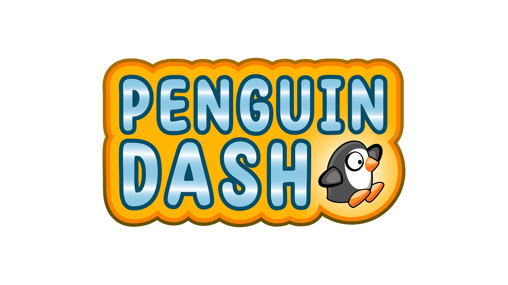

# Penguin Dash

  

## About

A penguin themed endless runner game made using the Stencyl engine. A lecture and laboratory activity for the creators' Human-compuer Interaction (HCI) subject.  

Documentation: [https://docs.google.com/document](https://docs.google.com/document/d/17Guy8YO3VsRs4pq2SGRU0S35wRik3zg6uEfpLvuGN50/edit?usp=sharing)

## Creators:

Section: **BCS22**
  * Sampot, Samantha
  * Uriarte, Philip Ronin
  * Uy, Richard Tyrese Michio
